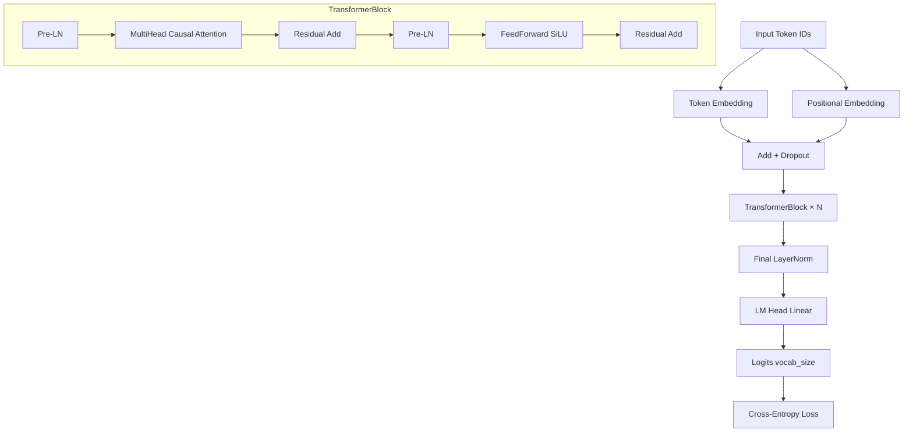

# ThinkyLM

> **ThinkyLM is an independently implemented decoder-only Transformer designed for critical and philosophical argumentation. It includes a custom tokenizer, random weight initialization, causal language-model pretraining, instruction training, evaluation, inference, testing, and API deployment.**

**Author**: Haziq Imran  
**Purpose**: AI developer portfolio project  
**Status**: 🟡 Architecture complete — awaiting meaningful cloud training

[](https://github.com/haziqimran/thinkylm/actions)
[](https://python.org)
[](LICENSE)
[](https://pytorch.org)

---

> **Honest Disclaimer**: The included local checkpoint is a small educational model and is not intended to match large commercial language models. At ~1M parameters trained for 20 steps on ~50K tokens, it demonstrates the engineering infrastructure, not language understanding.

---

## Table of Contents

- [What ThinkyLM Is](#what-thinkylm-is)
- [Key Features](#key-features)
- [Current Status](#current-status)
- [Architecture](#architecture)
- [Quick Start](#quick-start)
- [Installation](#installation)
- [Commands](#commands)
- [Repository Structure](#repository-structure)
- [Dataset Policy](#dataset-policy)
- [Hardware](#hardware)
- [Cloud Training](#cloud-training)
- [Evaluation](#evaluation)
- [Roadmap](#roadmap)
- [Contributing](#contributing)
- [Citation](#citation)

---

## What ThinkyLM Is

ThinkyLM is a **ground-up** language model — not a fine-tuned or renamed pretrained model. It is:

- ✅ A **custom decoder-only Transformer** written in raw PyTorch
- ✅ Trained with a **custom BPE tokenizer** trained from scratch
- ✅ Initialised from **random weights** (no OpenAI, Gemini, LLaMA, or any other base)
- ✅ A complete **ML engineering portfolio** demonstrating the full lifecycle

ThinkyLM is **not**:
- ❌ A ChatGPT or Claude wrapper
- ❌ A renamed pretrained model
- ❌ A RAG-only system
- ❌ Ready for production use at current scale

---

## Key Features

| Feature | Status |
|---|---|
| Decoder-only Transformer (Pre-LN, SiLU) | ✅ |
| Multi-head causal self-attention with verified mask | ✅ |
| Custom BPE tokenizer (Hugging Face Tokenizers) | ✅ |
| Causal LM pretraining with AdamW + cosine LR | ✅ |
| Instruction fine-tuning pipeline | ✅ |
| Checkpoint save/load (safetensors) | ✅ |
| Temperature / top-k / top-p / repetition penalty | ✅ |
| FastAPI REST API with Swagger docs | ✅ |
| Gradio web demo | ✅ |
| CLI inference | ✅ |
| Hardware safety checks | ✅ |
| Thinky-Bench evaluation (30 prompts, 10 categories) | ✅ |
| TensorBoard logging | ✅ |
| GitHub Actions CI | ✅ |
| Docker (CPU) | ✅ |
| Full test suite (~40 tests) | ✅ |
| Cloud training configs (10M, 25M) | ✅ |

---

## Current Status

```
✅ Milestone 1 — Repository, config, hardware checker, Transformer architecture, tests
✅ Milestone 2 — Tokenizer, sample corpus, data pipeline
✅ Milestone 3 — Training loop, checkpointing, monitoring, validation
✅ Milestone 4 — Instruction dataset (50 examples), Thinky-Bench (30 prompts), evaluation
✅ Milestone 5 — CLI, FastAPI, Gradio, Docker, GitHub Actions
✅ Milestone 6 — README, Model Card, Dataset Card, cloud guide, documentation

🟡 Training — Smoke test (20 steps) passes. Cloud training planned.
🔲 Checkpoint — No meaningful checkpoint exists yet.
🔲 Benchmark — Human evaluation not yet performed.
```

---

## Architecture

ThinkyLM is a **Pre-LayerNorm decoder-only Transformer**:



**Design choices**:
- Pre-LN for training stability
- SiLU (Swish) activation
- Fused QKV projection
- Weight tying (embedding ↔ LM head) in debug config
- Causal masking verified by automated tests
- No external ML library dependencies — raw PyTorch only

---

## Quick Start

### 1. Clone and Install

```powershell
# Windows
git clone https://github.com/haziqimran/thinkylm.git
cd thinkylm
python -m pip install torch --index-url https://download.pytorch.org/whl/cpu
python -m pip install tokenizers pyyaml pydantic fastapi uvicorn tqdm safetensors psutil httpx pytest ruff
```

```bash
# Linux / macOS
git clone https://github.com/haziqimran/thinkylm.git
cd thinkylm
./scripts/setup_linux.sh
```

### 2. Check Your Hardware

```powershell
python scripts/check_hardware.py
```

### 3. Prepare Data + Train Tokenizer

```powershell
python data_pipeline/prepare_sample_data.py
python tokenizer/train_tokenizer.py --vocab-size 4000
python tokenizer/evaluate_tokenizer.py
```

### 4. Run the Smoke Test (20 steps, ≤3 min)

```powershell
python training/pretrain.py --config configs/debug_1m.yaml
```

### 5. Run Tests

```powershell
python -m pytest tests/ -v --tb=short
```

---

## Installation

### Windows (PowerShell)

```powershell
# Recommended: use the setup script
.\scripts\setup_windows.ps1

# Or manually:
python -m pip install torch --index-url https://download.pytorch.org/whl/cpu
python -m pip install -r requirements-dev.txt
```

### Linux / macOS

```bash
chmod +x scripts/setup_linux.sh
./scripts/setup_linux.sh

# Or with make:
make setup
```

---

## Commands

### Hardware

```powershell
python scripts/check_hardware.py
```

### Data Pipeline

```powershell
# Create sample data
python data_pipeline/prepare_sample_data.py

# Train tokenizer
python tokenizer/train_tokenizer.py --input data/sample --vocab-size 4000 --output tokenizer/generated

# Evaluate tokenizer
python tokenizer/evaluate_tokenizer.py --tokenizer tokenizer/generated
```

### Training

```powershell
# Safe 20-step smoke test (CPU, ~1-3 min)
python training/pretrain.py --config configs/debug_1m.yaml

# Resume from checkpoint
python training/pretrain.py --config configs/debug_1m.yaml --resume checkpoints/debug_1m/debug_1m_step000020

# Instruction fine-tuning (after base training)
python training/instruct_train.py \
    --checkpoint checkpoints/debug_1m/debug_1m_step000020 \
    --data data/instructions/thinky_instructions.jsonl \
    --steps 20

# ⚠️  Cloud only — do NOT run locally:
# python training/pretrain.py --config configs/tiny_10m.yaml
# python training/pretrain.py --config configs/portfolio_25m.yaml
```

### Evaluation

```powershell
python evaluation/evaluate_checkpoint.py --checkpoint checkpoints/debug_1m/debug_1m_step000020
python evaluation/benchmark.py --checkpoint checkpoints/debug_1m/debug_1m_step000020
```

### Inference

```powershell
# CLI (interactive)
python inference/cli.py --checkpoint checkpoints/debug_1m/debug_1m_step000020

# CLI (single prompt)
python inference/cli.py --checkpoint checkpoints/debug_1m/debug_1m_step000020 \
    --prompt "Your conclusion is possible, although"
```

### API

```powershell
# Start FastAPI server
.\scripts\run_api.ps1
# OR:
$env:THINKYLM_CHECKPOINT="checkpoints/debug_1m/debug_1m_step000020"
uvicorn api.main:app --host 127.0.0.1 --port 8000

# Swagger docs: http://127.0.0.1:8000/docs
```

### Demo

```powershell
python demo/gradio_app.py --checkpoint checkpoints/debug_1m/debug_1m_step000020
# Opens at http://127.0.0.1:7860
```

### Testing

```powershell
# All tests
python -m pytest tests/ -v --tb=short

# Specific suite
python -m pytest tests/test_attention.py -v
python -m pytest tests/test_model.py -v
python -m pytest tests/test_api.py -v

# Windows script
.\scripts\run_tests.ps1
```

### Linting

```powershell
ruff check thinkylm/ training/ evaluation/ inference/ api/ data_pipeline/ tokenizer/ tests/
```

---

## Repository Structure

```
thinkylm/
├── README.md                    # This file
├── MODEL_CARD.md                # Model description and limitations
├── DATASET_CARD.md              # Dataset sources and licensing
├── CONTRIBUTING.md              # Contribution guidelines
├── SECURITY.md                  # Security policy
├── CITATION.cff                 # Citation file
├── CHANGELOG.md                 # Version history
├── pyproject.toml               # Ruff + Pytest config
├── requirements.txt             # Runtime dependencies
├── requirements-dev.txt         # Dev dependencies
├── Dockerfile                   # CPU-only Docker image
├── docker-compose.yml           # Docker Compose
├── Makefile                     # Linux/macOS shortcuts
│
├── configs/                     # YAML model configurations
│   ├── debug_1m.yaml            # ~1M params, CPU-safe, 20 steps
│   ├── tiny_10m.yaml            # ~10M params, CUDA 16 GB+ required
│   └── portfolio_25m.yaml       # ~25M params, CUDA 24 GB+ required
│
├── thinkylm/                    # Core model package
│   ├── __init__.py
│   ├── config.py                # Dataclass configuration system
│   ├── embeddings.py            # Token + positional embeddings, RoPE
│   ├── attention.py             # Multi-head causal self-attention
│   ├── feedforward.py           # SiLU feed-forward network
│   ├── block.py                 # Pre-LN Transformer block
│   ├── model.py                 # ThinkyLM top-level model
│   ├── generation.py            # Autoregressive generation
│   ├── checkpoint.py            # Save/load (safetensors)
│   └── utils.py                 # Hardware utils, RAM/disk checks
│
├── tokenizer/                   # Tokenizer training and evaluation
│   ├── train_tokenizer.py
│   ├── evaluate_tokenizer.py
│   └── sample_text.txt          # Original philosophy corpus
│
├── data_pipeline/               # Data preparation
│   ├── prepare_sample_data.py
│   ├── clean.py
│   ├── deduplicate.py
│   ├── split.py
│   ├── tokenize.py
│   ├── dataset.py               # PyTorch Dataset + DataLoader
│   └── manifest_example.csv     # Data licensing manifest
│
├── training/                    # Training system
│   ├── pretrain.py              # Main pretraining loop
│   ├── instruct_train.py        # Instruction fine-tuning
│   ├── optimizer.py             # AdamW with weight-decay separation
│   ├── scheduler.py             # Warmup + cosine decay
│   └── monitor.py               # TensorBoard + RAM/disk monitoring
│
├── evaluation/                  # Evaluation
│   ├── perplexity.py
│   ├── generation_metrics.py
│   ├── benchmark.py             # Thinky-Bench runner
│   ├── evaluate_checkpoint.py
│   └── thinky_bench.json        # 30 prompts × 10 categories
│
├── inference/                   # Inference
│   ├── cli.py                   # Interactive CLI
│   └── service.py               # Shared inference service
│
├── api/                         # FastAPI REST API
│   ├── main.py
│   ├── schemas.py               # Pydantic models
│   └── dependencies.py          # Dependency injection
│
├── demo/
│   └── gradio_app.py            # Gradio web interface
│
├── scripts/                     # Helper scripts
│   ├── check_hardware.py
│   ├── setup_windows.ps1
│   ├── setup_linux.sh
│   ├── run_tests.ps1
│   ├── run_debug_training.ps1
│   └── run_api.ps1
│
├── data/
│   ├── sample/                  # Sample training data (MIT-licensed original text)
│   └── instructions/
│       └── thinky_instructions.jsonl  # 50 instruction examples
│
├── reports/                     # Documentation
│   ├── architecture.md
│   ├── roadmap.md
│   ├── cloud_training_guide.md
│   ├── training_report_template.md
│   └── evaluation_report_template.md
│
├── tests/                       # Test suite
│   ├── test_config.py
│   ├── test_attention.py        # ← Causal mask correctness
│   ├── test_model.py
│   ├── test_model_ci.py         # ← CI forward-pass test
│   ├── test_tokenizer.py
│   ├── test_dataset.py
│   ├── test_generation.py
│   ├── test_checkpoint.py
│   ├── test_hardware_safety.py
│   └── test_api.py
│
└── .github/
    └── workflows/
        └── tests.yml            # GitHub Actions CI
```

---

## Dataset Policy

ThinkyLM uses **only original, legally clean text**:

- All training data is original content written by Haziq Imran for this project
- Released under the MIT licence
- No copyrighted books, scraped web content, or unlicensed corpora
- The instruction dataset (50 examples) is hand-written synthetic data

See [DATASET_CARD.md](DATASET_CARD.md) for full details.

For cloud training with larger corpora, see [reports/cloud_training_guide.md](reports/cloud_training_guide.md).

---

## Hardware

**Development machine**: Dell Inspiron 15 3511  
Intel Core i5-1135G7 | 16 GB RAM | Intel Iris Xe (no CUDA) | Windows 11

**Local safe defaults**:
- CPU threads: 2
- DataLoader workers: 0
- Batch size: 2
- Sequence length: 128
- Max training steps: 20
- Max runtime: 3 minutes

**Cloud training** (planned): RunPod A10G / A100

---

## Cloud Training

> Do not run `tiny_10m.yaml` or `portfolio_25m.yaml` locally.

| Config | Params | Device | Estimated Cost |
|---|---|---|---|
| debug_1m | ~1.1M | CPU | Free (local) |
| tiny_10m | ~10M | CUDA 16 GB+ | $1–3 on RunPod |
| portfolio_25m | ~25M | CUDA 24 GB+ | $15–30 on RunPod |

See [reports/cloud_training_guide.md](reports/cloud_training_guide.md).

---

## Evaluation

### Thinky-Bench

30 manually reviewable prompts across 10 categories:

| Category | Prompts |
|---|---|
| Claim clarification | 3 |
| Assumption detection | 3 |
| Steelmanning | 3 |
| Counterargument quality | 3 |
| Fallacy recognition | 3 |
| Belief updating | 3 |
| Uncertainty calibration | 3 |
| Philosophical comparison | 3 |
| Humour appropriateness | 3 |
| Respectful disagreement | 3 |

Human scoring: 0 (no attempt) → 4 (excellent)

**Current status**: No human evaluation performed. Awaiting meaningful training.

---

## Roadmap

See [reports/roadmap.md](reports/roadmap.md) for the full roadmap.

- **v0.1** (current) — Architecture + infrastructure complete
- **v0.2** (planned) — Train tiny_10m on cloud, publish checkpoint
- **v0.3** (planned) — Train portfolio_25m, human Thinky-Bench evaluation

---

## Contributing

See [CONTRIBUTING.md](CONTRIBUTING.md).

---

## Citation

```bibtex
@misc{thinkylm2026,
  author = {Haziq Imran},
  title  = {ThinkyLM: A From-Scratch Decoder-Only Transformer for Philosophical Argumentation},
  year   = {2026},
  url    = {https://github.com/haziqimran/thinkylm}
}
```

---

*"Your conclusion is possible, although premise two appears to have entered the argument without identification."*

*— ThinkyLM (eventual goal)*
